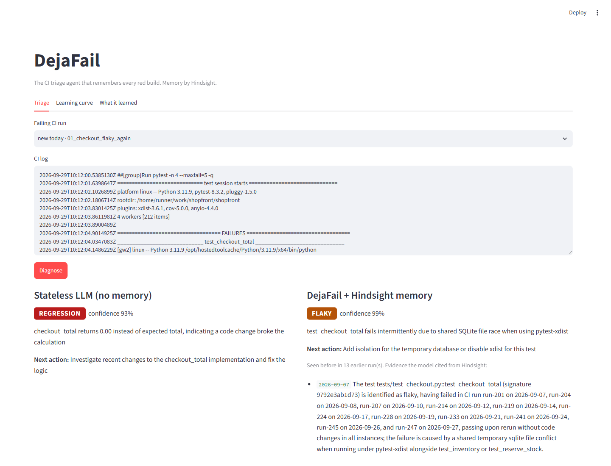

# DejaFail

**The CI triage agent that remembers every red build.**

A single failed CI log cannot tell you whether a test is flaky or actually broken. Flakiness is a property of *history*: the same failure, passing on rerun, again and again. DejaFail keeps that history in [Hindsight agent memory](https://github.com/vectorize-io/hindsight), so the fifth time `test_checkout_total` goes red it answers in seconds: *flaky, seen 4 times, passed on rerun every time, shares a temp DB with `test_reserve_stock`*, instead of sending you on a two-hour debugging detour.



## What it does

1. **Parses** a failing CI log into a stable failure signature (test id, error type, normalised message). Addresses, paths, hashes and timings are stripped so the same failure always gets the same signature.
2. **Recalls** earlier runs of that failure from Hindsight: exact matches by signature/test tag plus semantically similar errors.
3. **Decides** `flaky`, `regression`, `dependency`, `infra` or `unknown` with an LLM (Groq), citing the dated memories it used.
4. **Learns**: you confirm or correct the verdict and add the fix; DejaFail retains it, so the next similar failure is answered from memory.

The UI runs the same log through a stateless LLM and through DejaFail side by side, so the difference memory makes is visible.

## How Hindsight memory is used

| Hindsight feature | Where | What for |
|---|---|---|
| `retain` | `dejafail/memory.py` `record_failure`, `record_outcome` | Every failure and its outcome (rerun result, developer verdict, fix note), tagged `sig:<hash>`, `test:<id>`, `label:<kind>` |
| `recall` (tag-filtered) | `HindsightStore.history` | Exact history of this signature or test (`tags_match="any_strict"`) |
| `recall` (semantic) | `HindsightStore.history` | Similar errors in other tests, e.g. the same disk-full failure on a different job |
| Mental model | `MENTAL_MODEL_ID = "flaky-ledger"` | A consolidated "flaky ledger" shown in the *What it learned* tab |
| Directive | `DIRECTIVE` | Hard rule: never call a failure flaky if a code change fixed the same signature before |
| `reflect` | `HindsightStore.ask` | "Ask the ledger": e.g. *Which tests should we quarantine?* |

## Quickstart

```bash
py -3.11 -m venv .venv && .venv/Scripts/activate      # macOS/Linux: python3 -m venv .venv && source .venv/bin/activate
pip install -e ".[dev]"
cp .env.example .env                                     # add HINDSIGHT_API_KEY and GROQ_API_KEY
python -m dejafail replay --pause 2                      # replays 48 CI runs into memory, writes the learning curve
streamlit run app/streamlit_app.py
```

Keys: Hindsight Cloud at https://ui.hindsight.vectorize.io, Groq at https://console.groq.com.

## CLI

```bash
python -m dejafail diagnose data/shopfront/demo_logs/01_checkout_flaky_again.log --compare
python -m dejafail feedback data/shopfront/demo_logs/03_new_redis_outage.log --label infra --note "redis service container missing"
python -m dejafail seed --until 2026-09-20      # load history without LLM calls
python -m dejafail ask "Which tests should we quarantine?"
```

## Architecture

```
CI log -> signature.py -> triage.py -> llm.py (Groq, JSON mode, validated + retried)
                              ^  |
              recall (tagged + semantic)   verdict -> CLI / Streamlit -> developer feedback
                              |  v                                            |
                        memory.py <-> Hindsight Cloud  <---- retain ----------+
```

## Data

`data/shopfront/runs.jsonl` is a synthetic three-week CI history of a fictional checkout service (48 failing runs), generated deterministically by `scripts/build_dataset.py`. It plants realistic recurring patterns: a pair of flaky tests sharing a temp database, a pydantic 2 upgrade break that returns two weeks later, an arm64 runner that keeps running out of disk, a real rounding regression, and one-off failures. Each run carries the ground-truth label used to score the learning curve. Accuracy numbers shown in the UI come from this synthetic replay.

## Tests

```bash
python -m pytest -q          # no network; Hindsight and Groq are faked
python scripts/smoke_live.py # one real round trip (needs .env)
```

## Limitations

- The failure parser covers pytest, Jest, JUnit, npm and GitHub Actions error lines; other runners fall back to the first `...Error:` line.
- Memory quality depends on consistent signatures; a test that fails with a new message starts a new history (by design: it may be a real bug).
- Verdicts are advisory. DejaFail never reruns or quarantines tests on its own.

## Links

- Hindsight on GitHub: https://github.com/vectorize-io/hindsight
- Hindsight docs: https://hindsight.vectorize.io/
- What agent memory is: https://vectorize.io/what-is-agent-memory
